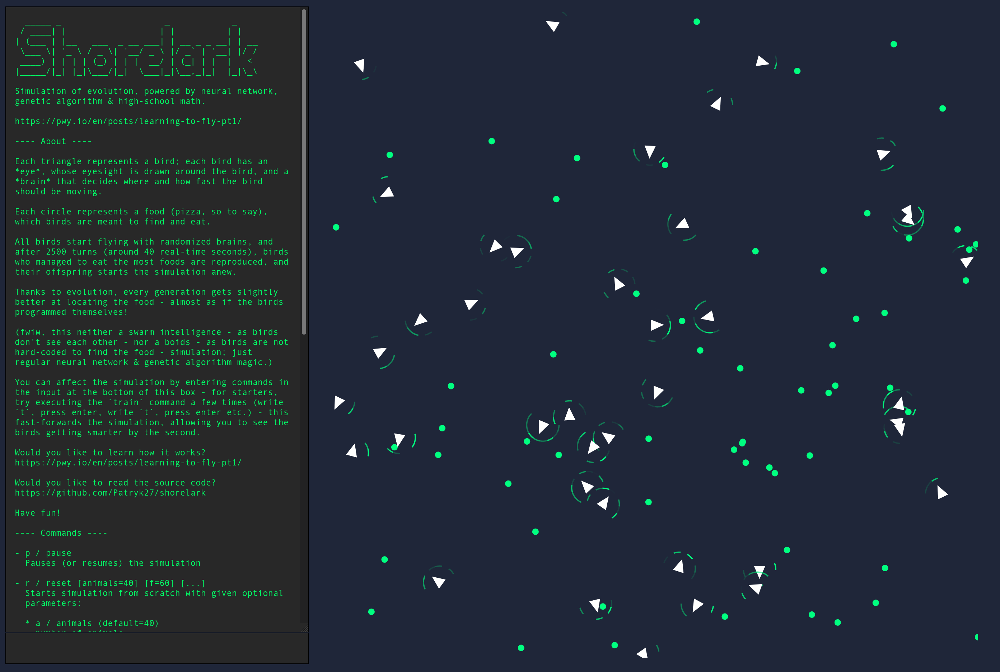

# 🐦 Shorelark

Simulation of evolution, powered by neural networks, genetic algorithms & high-school math:



Feeling curious? I've described the implementation _ab ovo_ on my blog: [Learning to Fly](https://pwy.io/en/posts/learning-to-fly-pt1).

# Building

## Using [Nix](https://nixos.org)

```bash
# 1/3: Clone the repository
$ git clone https://github.com/patryk27/shorelark
$ cd shorelark

# 2/3: Build the application
#      (this might take a few minutes)
$ nix build
#
# ^ This command will create a directory called `result`
#   that'll contain the compiled WebAssembly code and a few
#   frontend files.
#
# If `nix build` fails, you might be using an older version
# of Nix that doesn't support flakes - if that's the case,
# please use this command instead:
#
# $ nix-build

# 3/3: Start the frontend application
$ nix shell nixpkgs#php80 -c php -S localhost:8080 -t result
#
# ^ After launching this, open `http://localhost:8080` in
#   your web browser - you should see the simulation working
#   as the doctor ordered :-)

# > But why are we downloading PHP? This seems insane!
# 
# It's due to CORS:
# https://stackoverflow.com/questions/10752055/cross-origin-requests-are-only-supported-for-http-error-when-loading-a-local
#
# Bottom line: it's not possible to open a local HTML file
# and make it load WebAssembly code - there *has* to be a
# web server used; and it just happens that PHP includes 
# a simple web server out of the box.
#
# If you don't want PHP on your machine - :-) - anything
# from this list will do the work, too:
#
# https://gist.github.com/willurd/5720255
```

## Using Cargo and npm

```bash
# 1/3: Clone the repository
$ git clone https://github.com/patryk27/shorelark
$ cd shorelark

# 2/3: Compile Rust into WebAssembly
#      (this might take a minute)
$ cd libs/simulation-wasm
$ wasm-pack build --release

# 3/3: Start the frontend application
$ cd ../../www
$ npm install
$ npm run start

# ^ After launching this, open `http://localhost:8080` in
#   your web browser - you should see the simulation working
#   as the doctor ordered :-)
```

# Usage

Shorelark contains a simple in-game introduction - just read what the terminal on the left side says and have fun!

# License

Copyright (c) 2020-2022, Patryk Wychowaniec <pwychowaniec@pm.me>.    
Licensed under the MIT license.
